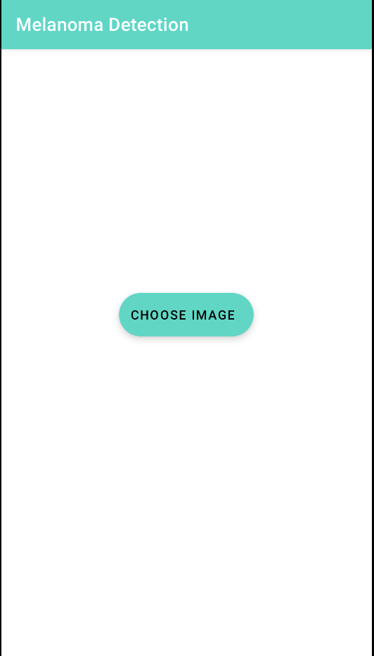
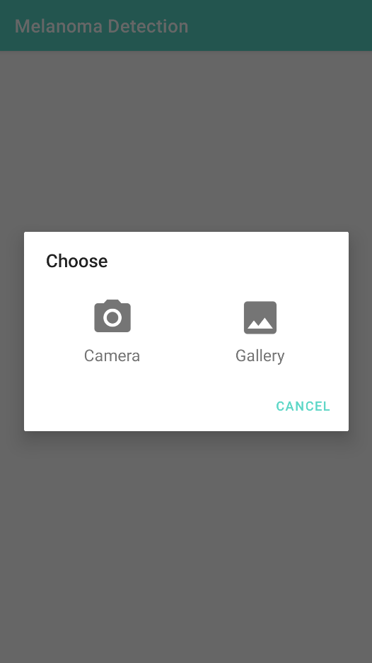
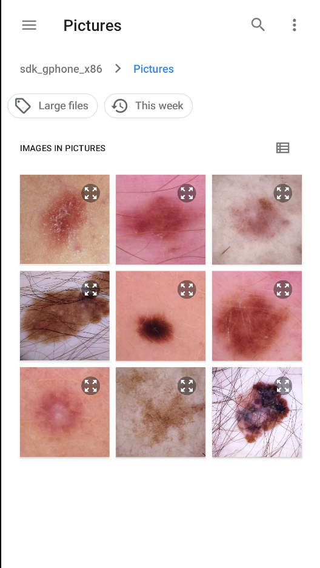
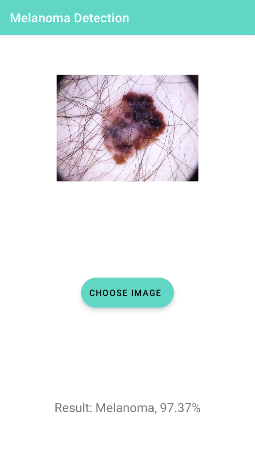

# Malignant Melanoma Identification App

## Overview
This project is a mobile application designed to assist in the early detection of malignant melanoma by leveraging machine learning. The app allows users to input images of moles and provides predictions on whether the mole is likely to be benign or malignant. It is developed for Android platforms and aims to bridge the accessibility gap in melanoma detection.

## Why This Project?
Melanoma, a type of skin cancer, is highly treatable if detected early. However, timely detection can be challenging due to lack of access to dermatological expertise. With advancements in machine learning, early detection is now possible. This app provides an easy-to-use solution to identify potential melanomas and encourages users to seek medical advice when necessary.

## Features
### Functional Requirements:
- Upload an image of a mole via the app (from the camera roll).
- Process the image and extract features.
- Use a machine learning model to predict whether the mole is likely to be melanoma or not.
- Provide the user with a prediction along with the probability of accuracy.

### Non-Functional Requirements:
- Intuitive and user-friendly interface.
- Provide warnings that predictions are not clinical diagnoses and recommend consulting a medical professional.
- Include prediction accuracy feedback based on image quality.

## Implementation
### Machine Learning Model
- **Model Type**: Convolutional Neural Network (CNN).
- **Input Features**: Mole images converted into RGB numpy arrays with a shape of `(150, 200, 3)`.
- **Dataset**: Approximately 2,200 images were used, with 10% reserved for validation.
- **Performance**:
  - Training Loss: `0.2179`
  - Training Accuracy: `91.03%`
  - Validation Loss: `0.3555`
  - Validation Accuracy: `82.69%`

### Mobile App Development
- **Tools**: 
  - Android Studio
  - TensorFlow Lite
  - ImagePicker for user image selection
- **Design**: Simple and intuitive UI to ensure accessibility.

### Screenshots
Below are screenshots showcasing the application:

  
  
  
  

## Challenges
- Sprint time estimation issues.
- Resource exhaustion errors during model training.
- Overfitting of the machine learning model.

## Testing and Results
- Achieved a test set accuracy of `92%`.
- Functional requirements were successfully met.
- The app consistently produces accurate predictions.

## Evaluation
- **Accessibility**: The app is easy to use and suitable for the general public.
- **Consistency**: Provides accurate and consistent predictions.
- **Objective Fulfillment**: Successfully met the initial goals of the project while gaining valuable learning experience.

## Future Work
- Reduce false negatives to improve prediction reliability.
- Enhance the app design for better user experience.

## Conclusion
This project demonstrates the effective use of machine learning in a real-world application to address an important healthcare issue. It achieves its functional objectives and lays the groundwork for further enhancements.

---

## Disclaimer
This application is not a replacement for professional medical advice, diagnosis, or treatment. Users are strongly encouraged to consult a qualified healthcare provider for any concerns regarding their skin health.

---

## Author
Tom Kelly 
